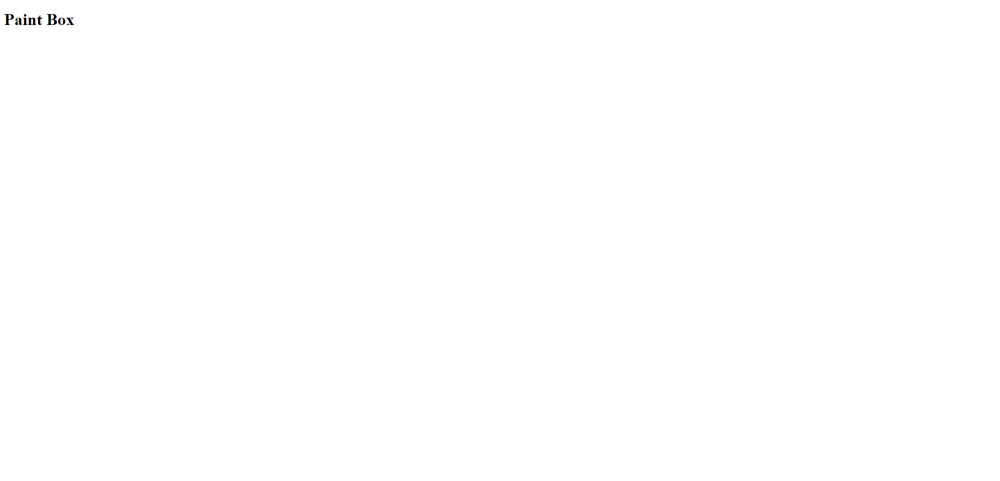
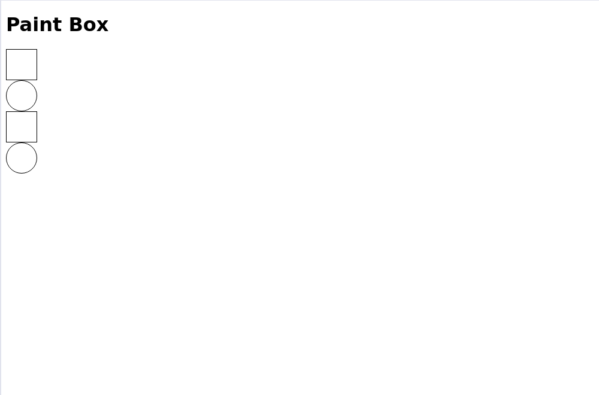
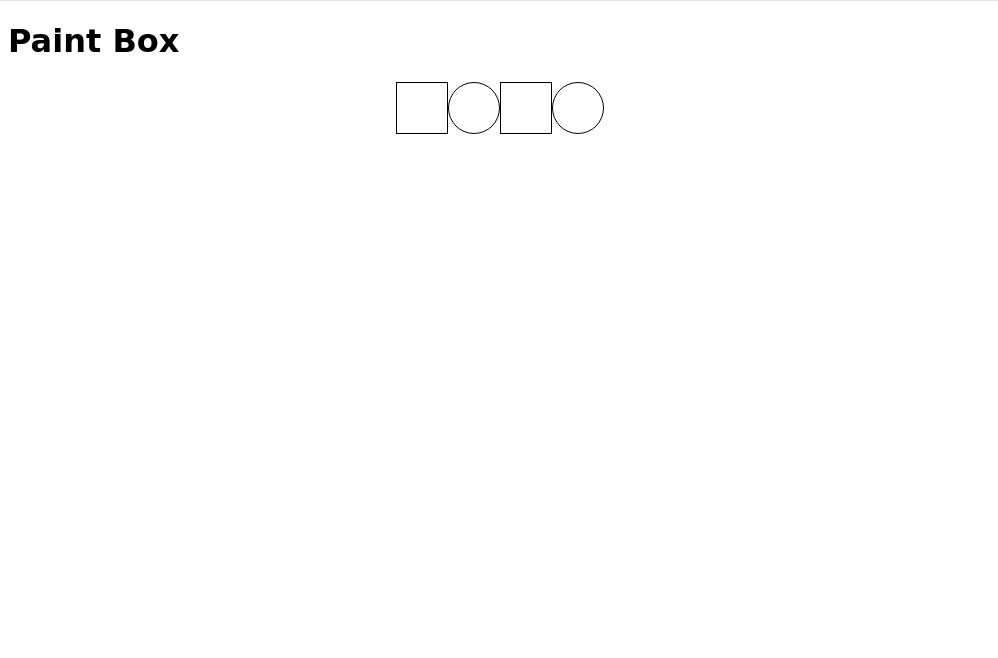
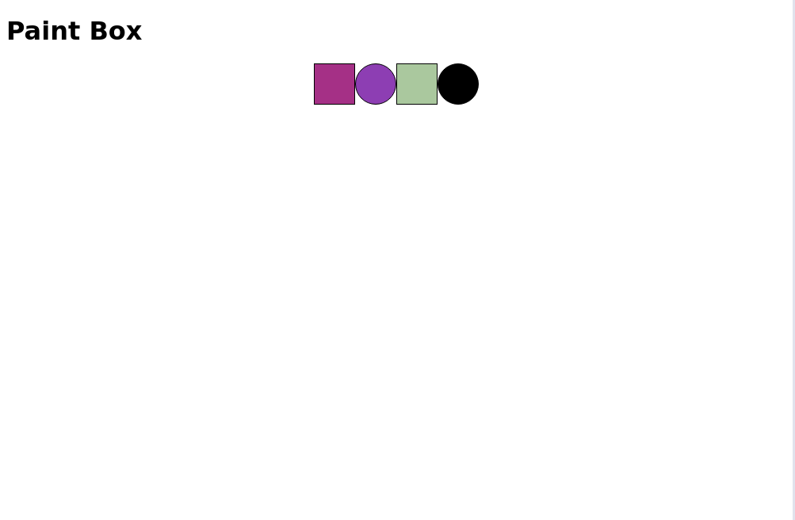
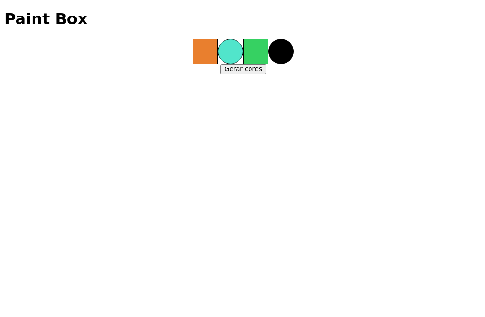
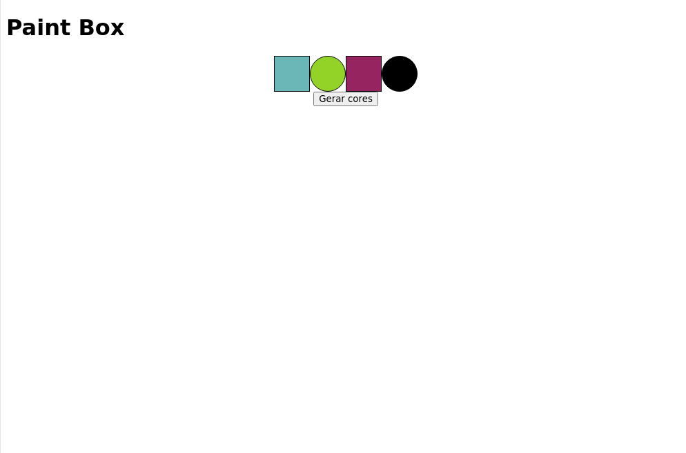
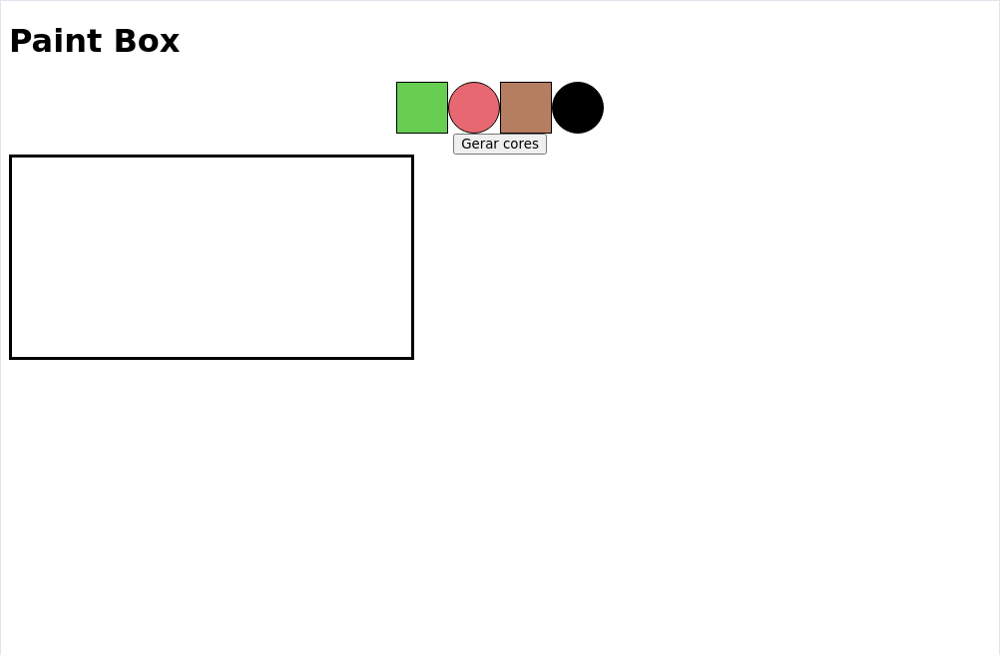
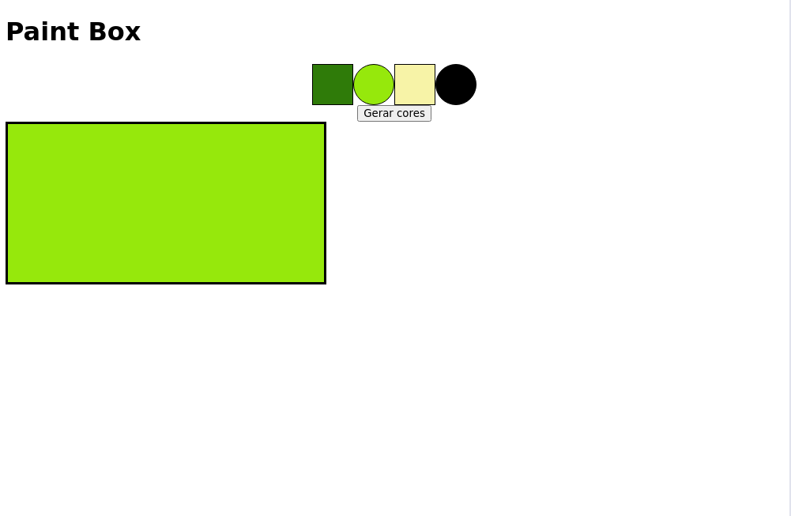
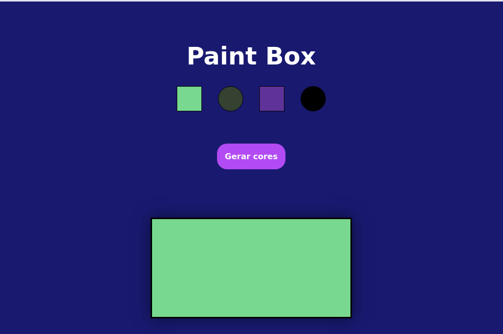

# Boas-vindas ao repositório do exercício de paintBox Project!
Este projeto foi desenvolvido por Aysllan Ferreira, enquanto estudante na Trybe para servir como material de apoio para as pessoas estudantes se prepararem para o projeto Pixel Art.

# Orientações
	
<details>
<summary><strong>‼ Antes de começar a desenvolver</strong></summary><br />

1. Clone o repositório

	*  Use o comando: `git@github.com:aysllanferreira/paintBox-Project.git`

* Entre na pasta do repositório que você acabou de clonar:

	*  `cd paintBox-Project`

2. Instale as dependências

	* Para isso, use o seguinte comando: `npm install`
	
</details>

<details>
<summary><strong>🎛 Linter</strong></summary><br />

Para simular um ambiente real de projeto, nós usaremos o [ESLint](https://eslint.org/) para fazer a análise do código.
	
</details>

<details>
<summary><strong>🛠 Testes</strong></summary><br />

Para os testes serem realizados com exito, certifique-se que a versão do seu node seja de fato a versão 16.

```bash
node -v
```

Caso você esteja utilizando outra versão, você pode usar este comando para alterar sua versão para 16.

```bash
nvm use 16
```

Todos os requisitos serão testados pelo Cypress. Para rodar todos os testes, basta rodar no terminal o comando.

```bash
npx cypress open
ou
npx cypress run
```
</details>

<br>

### Boa sorte!!!
<br>

# Requisitos do projeto

## 1. Implementa o `Header` de sua pagina.

<details>
  <summary>
  Crie um Header para sua página.
  </summary> <br />

- Dentro da div com o ID: app, crie um `header`.
- Dentro do seu header, crie um elemento com a tag `h1`.
- O texto do seu H1 deve ser: `Paint Box`.

**O que será testado:**

- Sua página deve conter um elemento com a tag Header como filho da div com o id app.

- Sua página deve conter um elemento h1 com o texto Paint Box como filho do elemento header.

## Exemplo


</details><br>

## 2. Crie os elementos de sua `Paleta de cores`.

<details>
  <summary>
  Implemente sua página criando elementos que futuramente receberá 
  </summary> <br />

- Crie uma `div` que seja filhas do elemento com id: `app`.
- Essa div deve conter o id: `pallete`.
- Crie 4 `div` que sejam filhas do elemento que contenha o id `pallete`.
- Essas divs devem conter a classe `color`.
- Essas divs devem conter uma `borda solida preta de 1px`.
- Essas divs devem conter `50px de altura`.
- Essas divs devem conter `50px de largura`.
- A segunda e a última div deve conter um `border-radius` de 50%.

**O que será testado:**

- Deverá conter uma `div` com o id `pallete` que seja filho do elemento `app`.
- Deverá haver 4 divs com a classe `color`.
- Elas devem ter uma `borda solida preta de 1px`.
- Essas divs devem conter `50px de altura e largura`.
- A segunda e a última div deve conter um `border-radius` de 50%.

## Exemplo


</details><br>

## 3. Alinhe e centralize sua `Paleta`.

<details>
  <summary>
  Usando manipulação do DOM para definir estilos, alinhe lado a lado e centralize sua paleta.
  </summary> <br />

- Usando o `display: flex`, alinhe lado a lado sua paleta.
- Usando o `justify-content: center`, centralize sua paleta.


**O que será testado:**

- Verificará se sua paleta está alinhada lado a lado e está no centro da tela.

## Exemplo


</details><br>

## 4. Gere `cores aleatórias` para sua paleta.

<details>
  <summary>
  Usando manipulação do DOM, preencha aleatóriamente as cores para sua paleta.
  </summary> <br />

- As 3 primeiras cores devem ser preenchidas de forma aleatória.
- A última cor deve ser sempre `preta`.
- A paleta `não` pode possuir a cor branco absoluto. `rgb(255,255,255) ou #FFFFFF`.


**O que será testado:**

- As 3 primeiras cores devem ser aleatórias.
- A última cor deve ser `preta`.
- Nenhuma cor pode ser da cor branco absoluto.

## Exemplo


</details><br>

## 5. Crie um `botão` para criar novas cores aleatórias.

<details>
  <summary>
  Implementa um botão na sua página que ao clicado, atualizará a paleta de cores.
  </summary> <br />

- Crie uma nova `div`.
- Utilize `display flex` e `justify-content: center` nessa div.
- Crie um botão com o id `new-colors` e o coloque como filho dessa nova div.
- Dê a esse botão o texto `Gerar cores`.
- Ao ser clicado, esse botão deverá gerar novas cores aleatórias para a paleta.
- A última cor deve permanecer `preta`.

**O que será testado:**

- Verificará se existe um botão no centro da tela com o id `new-colors`.
- Verificará se o botão contem o texto `Gerar cores`.
- Ao ser clicado, deverá gerar novas cores aleatórias para paleta.
- A última cor deve permanecer `preta`.
- Não será permitido as cores serem exatamentes as mesmas da paleta anterior.

## Exemplo


</details><br>

## 6. Salve as cores da paleta no `LocalStorage`.

<details>
  <summary>
  Salve as cores da paleta no `LocalStorage`.
  </summary> <br />

- Salve as cores da paleta no `LocalStorage` usando a chave `colors`.
- Quando clicar no botão de gerar novas cores, as novas cores geradas também devem ser salvas.
- Ao recarregar a página, as cores geradas devem permanecer as mesmas.

**O que será testado:**

- Verificará se as cores foram salvas no `LocalStorage` com a chave `colors`
- Verificará se ao recarregar a página, as cores vão permanecer as mesmas.
- Verificará se ao clicar no botão gerará novas cores e ao recarregar a página, as cores vão se manter.

## Exemplo


</details><br>

## 7. Dê a classe `selected` para a cor selecionada.

<details>
  <summary>
  Ao clicar em uma das cores da paleta, esse elemento deve receber a classe selected.
  </summary> <br />

- Por padrão, a primeira cor deve receber `selected` inicialmente.
- Ao clicar em uma das cores, a cor que contem a classe `selected` deve ter essa classe removida.
- Ao clicar em uma das cores, a nova cor clicada deve receber a classe `selected`.


**O que será testado:**

- A primeira cor inicialmente deve possuir a classe `selected`.
- Ao clicar em uma cor, o elemento que tinha a classe `selected` deve perder a classe.
- A cor clicada deve receber a classe `selected`.

</details><br>

## 8. Crie um `quadro` para ser pintado.

<details>
  <summary>
  Crie um quadro para que futuramente receba as cores da paleta.
  </summary> <br />

- Crie uma div com o id `board` que seja filho do elemento que tenha o id `app`.
- Dê a essa div uma `borda solida preta de 3px`.
- De a essa div uma `largura de 400px`.
- De a essa div uma `altura de 200px`.
- Dê inicialmente o background `branco` pra essa div.

**O que será testado:**

- A div deve possuir a classe `board` e ser filho de `app`.
- A div deve possuir uma `borda solida preta de 3px`..
- A div deve ter 400px de `largura` e 200px de `altura`.
- A div deve ter um background `branco` inicialmente.

## Exemplo


</details><br>

## 9. Implemente uma lógica pra pintar o `quadro`.

<details>
  <summary>
  Com a cor selecionada, ao clicar no quadro, ele deve ser preenchido com essa cor.
  </summary> <br />

- Ao selecionar uma cor na palete e clicar no `quadro`, ele deve ser preenchido com a respectiva cor.
- Ao selecionar outra cor e clicar no `quadro` ele deve ser preenchido com aquela nova cor.

**O que será testado:**

- Ao selecionar uma cor e clicar no `quadro`, ele deve ser preenchido com a respectiva cor.

## Exemplo


</details><br>

## 10. Salve a cor pintada no `quadro` no `LocalStorage`.

<details>
  <summary>
  A cor que foi pintado no quadro, deve ser salva também no LocalStorage.
  </summary> <br />

- Salve a cor pintada no quadro no `localStorage` com a chave `board-color`.
- Ao clicar no `quadro` e ele receber uma cor, ao recarregar a página a cor deve ser mantida.

**O que será testado:**

- A cor recebida pelo quadro deve ser salva no `localStorage` com a chave `board-color`.
- Ao clicar no `quadro` e ele receber uma cor, ao recarregar a página a cor deve ser mantida.

</details><br>

# Requisito não avaliativo.

## Estilize o projeto com o CSS comum.

<details>
  <summary>
  Hora de estilizar o projeto com o CSS comum e deixá-lo bonito.
  </summary> <br />

- Estilize o projeto.
- Poste no seu LinkedIn ou GitHub! =D

## Exemplo


</details><br>